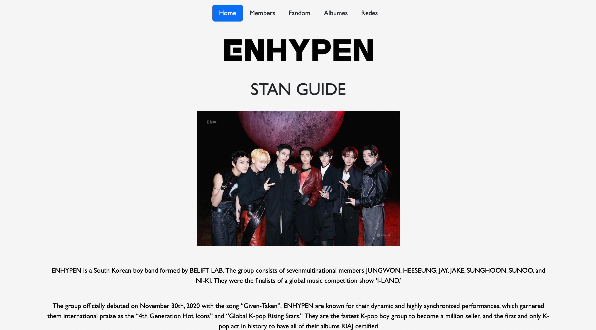
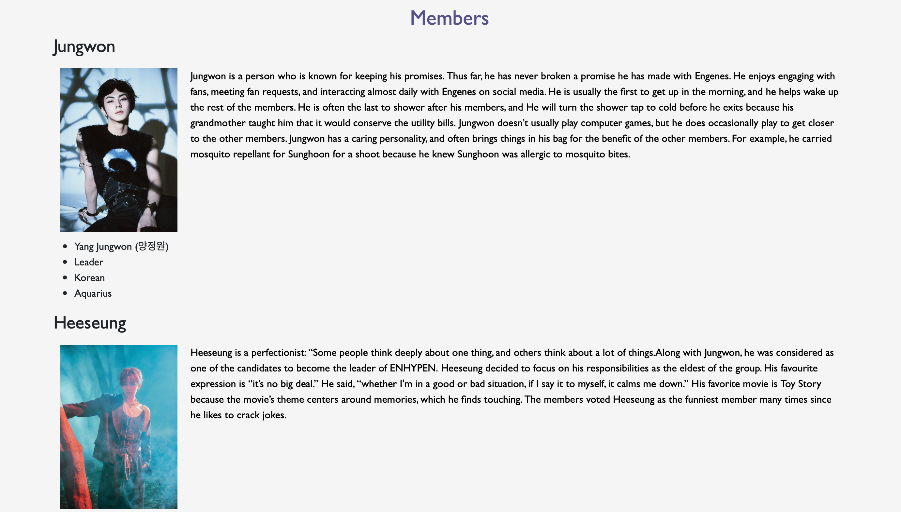
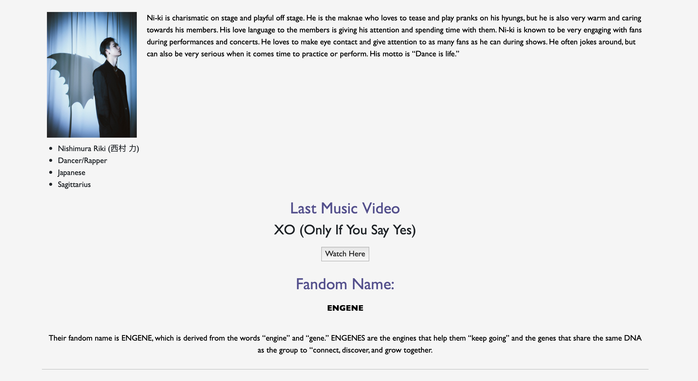
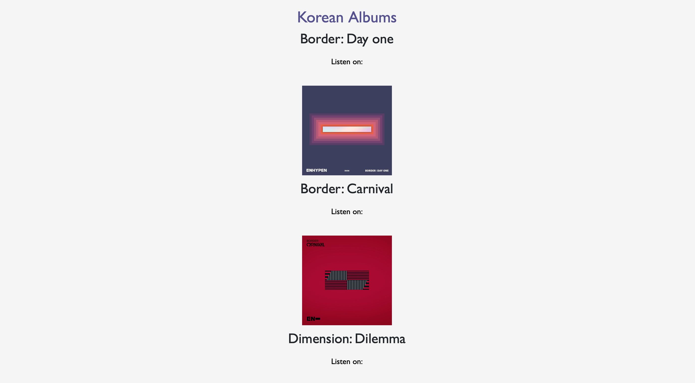
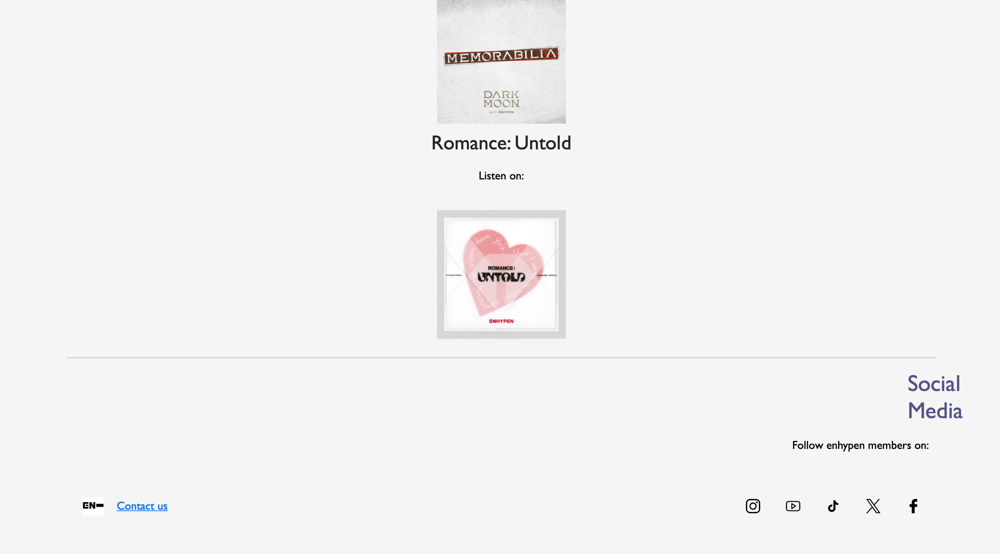

# Proyecto: Mi primer página, para TECNOLOCHICAS PRO

El presente proyecto consiste en la primera actividad realizada dentro del bootcamp de desarrollo frontend de Technolochicas PRO para poner en práctica las habilidades obtenidas dentro de la primera semana del programa.

Fue desarrollado de 0 con HTML y CSS con el uso de el framework de Boostrap utilizando además bibliotecas externas.

La página es responsiva (adaptable a diferentes tamaños de pantalla) e incluye la presentación de la autora del proyecto.

[Proyecto desplegado](https://project-enhypen.netlify.app)

## Secciones de mi sitio

## Tecnologías
* HTML
* CSS
* Bootstrap

---

Desarrollado con 💟 por [Evelyn](https://evelynperea.netlify.app) en [TECHNOLOCHICAS PRO](https://tecnolochicas.mx)